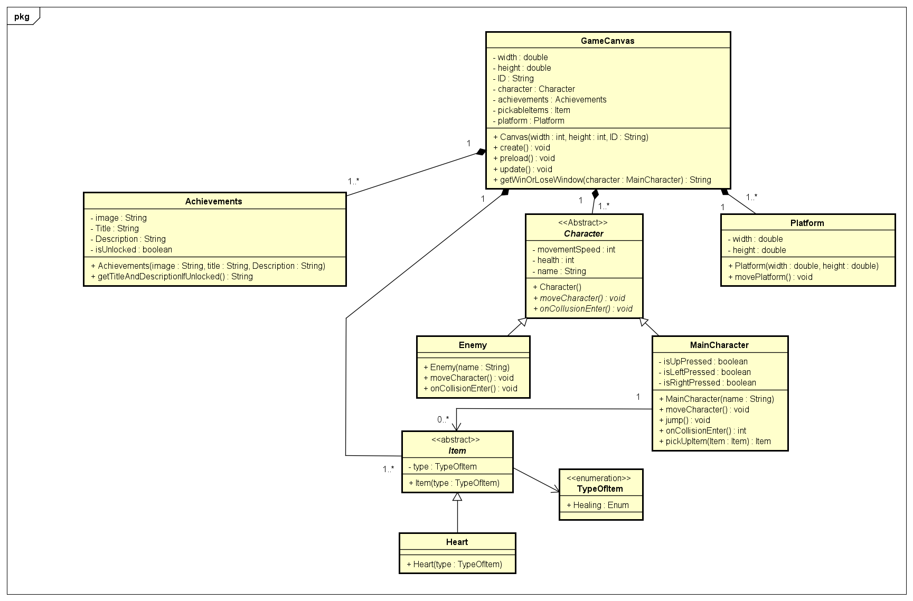

# Jump king

## Description
Jump king is a 2d platform game that revolves around the main character whose goal is to jump from one platform to another until he reaches the top. The player puts himself in the boots of a king whose motivation is safe, something that belongs to him. At the highest point is where a "Smoking hot babe" is, and the goal of the king is to search for her while struggling to go upwards. The special mechanic of the game is that the character can only jump in the direction that he is facing, and the user cannot control the character while he is in mid-air. Тhe jump must be carefully thought out because one mistake could lead to a long fall back down. The game controls are simple.

The player can move the character left, right and jump. The jump can have various heights depending on how long the player has held the jump button. The direction of the jump is based on the direction he is faced. The game character does not have fall damage. The challenge of the game is to climb upwards, avoiding falling down as much as possible. The character might even fall at the bottom, which is the beginning level of the game, if there are no platforms where he can land.

The unique selling points are as follows:

* Achievements: achievements will be included to provide the player with a sense of progression.
* Enemies and character health bar: Enemies will be moving left and right on the platform that they are currently on. If the character collides with the enemy, he will lose one hearth, and if there are no hearths left, he will have to start from the beginning. The enemy can be killed if the character jumps at the top of them.
* Moving platforms: Since the original game does not provide any moving platforms, this version will include additional platform movements to make it more challenging for the player.

## Phaser JS

For the project, framework such as Phaser Js will be used. This framework is fast and lightweight and is suitable for 2d games,making it perfect for the development of this game.It has support for both WebGL and Canvas.It allows for fast rendering,because both WebGL and Canvas are being rendered internally and can switch between them depending on the browser.

## Input
This section describes the inputs that will be included in the game.
#### Character
|     Case       |       Type        |    Condition  |
|----------------|-------------------|---------------|
|PlayerHealth    |        int        |    >=0 and <=3|

#### Heart
|     Case       |       Type        |    Condition  |
|----------------|-------------------|---------------|
|TypeOfItem      |       Enum        |    >=0 and <=3|

#### GameCanvas
|     Case       |       Type        |    Condition  |
|----------------|-------------------|---------------|
|CanvasWidth     |   double          |    >= 0       |
|CanvasHeight    |   double          |    >= 0       |
|CanvasId        |   int             |    >= 0       |

#### Achievements
|     Case       |       Type        |    Condition  |
|----------------|-------------------|---------------|
|Icon/Image      |   String          |    not empty  |
|Title           |   String          |    not empty  |
|Description     |   String          |    not empty  |
|isUnlocked      |   boolean         |initially false|

## Output
This section describes the overall outputs of the game.

|              Case                         |       Type        |
|-------------------------------------------|-------------------|
|The item,which the character picks up      |       Item        |
|Game over screen/You win screen            |       String      |
|The number of hearts left                  |       int         |
|Achievements unlocked message              |       String      |

## Class diagram
This section illustrates the uml class diagram

## Remarks

## Test plan
This section describes the test plan

#### GameCanvas

|  objectName    |     object type   |    width      |    height     |      Id      |
|----------------|-------------------|---------------|---------------|--------------|
|gameCanvas      |   GameCanvas      |     800       |     600       |      1       |

#### Character
|  objectName    |     object type   |
|----------------|-------------------|
|jumpKing       |   MainCharacter   |

#### Enemy

|  objectName    |     object type   |
|----------------|-------------------|
|   lizard       |      Enemy        |

#### Achievements 

|  objectName    |     object type   |    image      |    title      |     Description        |
|----------------|-------------------|---------------|---------------|------------------------|
|firstLevel      |   Achievement     |"RandomImage"  |   Rookie      |Complete the first level|

#### Item

|  objectName    |     object type   |  type  |
|----------------|-------------------|--------|
|    heart       |      Heart        | Healing|

#### Platform

|  objectName    |     object type   |  width | height|
|----------------|-------------------|--------|-------|
|    platform    |      Platform     |  200   |  50   |

## Test cases

### pickUpItem

This section will describe `pickUpItem()` if it's working correctly

#### pickUpItemIfHealthBarNumberIsLessThanThree

|#   |MainCharacter   |       Action              |         Expected output           |
 |---:|---------------|---------------------------|-----------------------------------|
 | 1  | Jump king      |`pickUpItem(heart:Heart)` |heart(HealthBar increments by one)|

#### pickUpItemIfHealthBarNumberIsThree

|#   |MainCharacter   |       Action              |             Expected output        |
|---:|----------------|---------------------------|------------------------------------|
| 1  | Jump king      |`pickUpItem(heart:Heart)`  |heart(HealthBar stays the same number|

### onCollisionEnter

This case provides information about `onCollisionEnter()` .

#### onCollisionEnterWithEnemy

|#   |MainCharacter   |       Action              |             Expected output        |
|---:|----------------|---------------------------|------------------------------------|
| 1  | Jump king      |   `onCollisionEnter()`    |PlayerHealth decrements by one(3-1=2)|

### getTitleAndDescriptionIfUnlocked()

This section checks if `getTitleAndDescriptionIfUnlocked()` works properly.

#### getTitleAndDescriptionIfUnlocked

|#   |  Achievement   |                Action              |     Expected output             |
|---:|----------------|------------------------------------|---------------------------------|
| 1  | firstLevel     |`getTitleAndDescriptionIfUnlocked()`|Rookie: Complete the first level |

### getWinOrLoseWindow()

This test section describes how `getWinOrLoseWindow()` works .

#### getWinOrLoseWindowIfTheCharacterLosses

|#   |   GameCanvas   |                    Action                  |             Expected output             |
|---:|----------------|--------------------------------------------|-----------------------------------------|
| 1  | gameCanvas     |`getWinOrLoseWindow(jumpKing:MainCharacter)`|        You failed! Try again ?          |

#### getWinOrLoseWindowIfTheCharacterWins

|#   |   GameCanvas   |                    Action                  |                Expected output               |
|---:|----------------|--------------------------------------------|----------------------------------------------|
| 1  | gameCanvas     |`getWinOrLoseWindow(jumpKing:MainCharacter)`|Congrats!You beat the game and saved the queen|